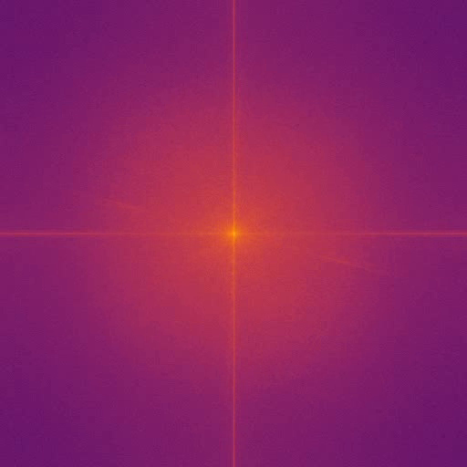
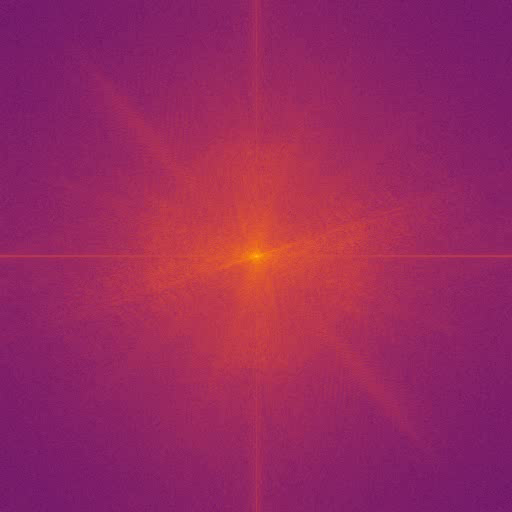
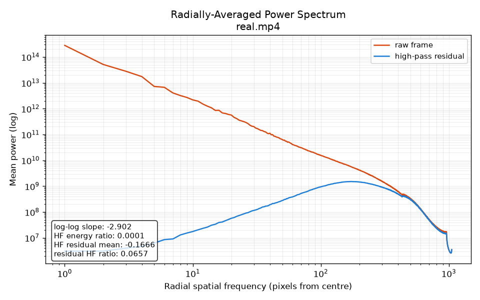
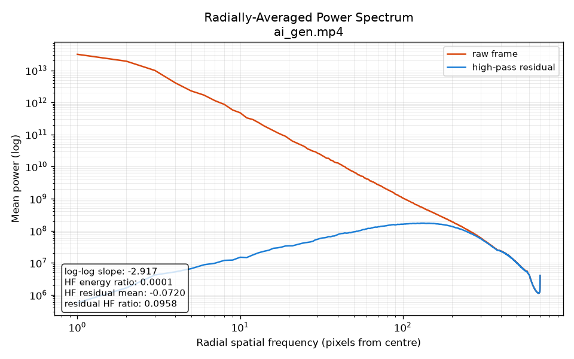
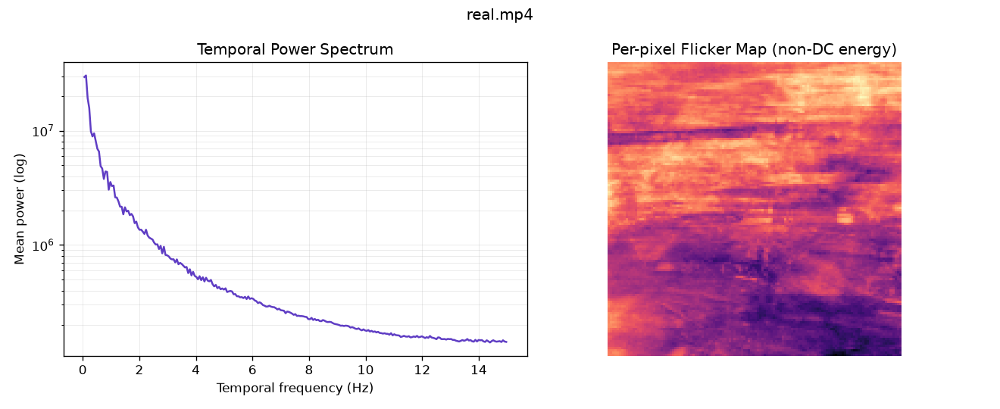
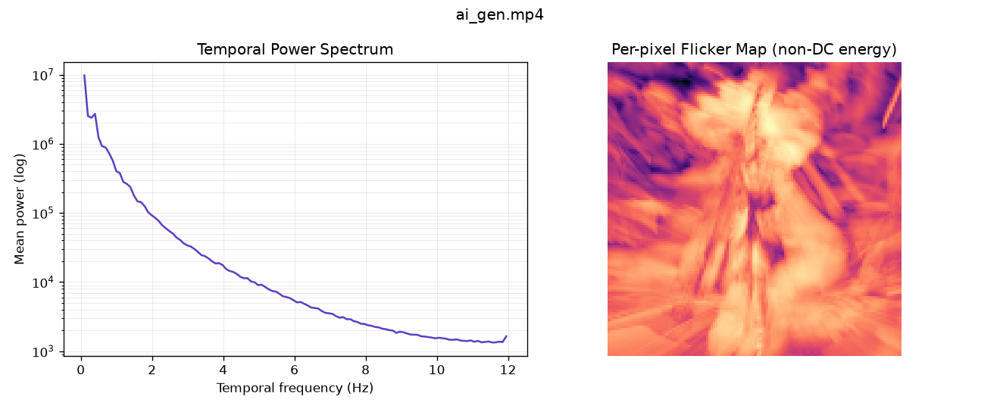

# Video Spectra — Spectral Analysis for AI-Generated Video Detection

A Python tool that takes an MP4 video, renders its per-frame frequency-space
(FFT) spectrum as a new MP4, and analyses the clip for spectral/temporal
fingerprints commonly left by AI-generated (GAN / diffusion) video.

> **Important:** every metric here is a *heuristic*, not proof. Video
> compression weakens these signals and newer generators actively suppress
> them. Always compare results against a real-footage baseline captured with a
> similar camera and codec. See [Limitations](#limitations).

---

## Features

For any input `video.mp4`, the tool writes five files next to the original:

| Output | Description |
| --- | --- |
| `video_spectra.mp4` | 512×512 (1:1) colour spectrum video — one FFT frame per source frame, log-scaled, inferno colormap. |
| `video_rapsd.png` | Radially-Averaged Power Spectrum (RAPSD), averaged over all frames. Plots the raw-frame curve and the high-pass residual curve. |
| `video_rapsd.csv` | Summary features plus the full RAPSD curves (raw + residual) for numeric comparison. |
| `video_temporal.png` | Temporal power spectrum (per-pixel FFT along time) plus a per-pixel flicker map. |
| `video_report.txt` | All extracted features plus a single combined "synthetic likelihood" score. |

A separate calibration helper, `calibrate.py`, can fit a model from your own
labelled clips — see [Calibration](#calibration-optional-recommended-with-enough-clips).

---

## Installation

Requires Python 3.10+.

```powershell
pip install -r requirements.txt
```

Dependencies: `numpy`, `opencv-python`, `matplotlib`.

---

## Usage

### Command line

```powershell
python video_spectra.py input.mp4
# optional explicit spectrum-video output path:
python video_spectra.py input.mp4 custom_spectra.mp4
```

### Drag-and-drop (Windows)

Drag an `.mp4` file onto `video_spectra.bat`. All outputs are written next to
the original video.

### Calibration (optional, recommended with enough clips)

`calibrate.py` fits a model from your own labelled clips to customize the detector:

```powershell
python calibrate.py --real <real_dir_or_files> --synthetic <ai_dir_or_files> --num-features 3 --l2 2
```

It writes `calibration.json`; once that file exists, `video_spectra.py` uses the
fitted model automatically (and the report names the scorer). Delete
`calibration.json` to revert to the hand-tuned ramps.

To avoid overfitting on small datasets the tool:

- standardises features and uses L2-regularised logistic regression (`--l2`);
- reports **leave-one-out cross-validation** accuracy with per-fold
  standardisation (an honest generalisation estimate — trust this, not the
  training-clip scores);
- can keep only the K most-separating features (`--num-features`);
- prints a loud warning when there are too few clips per feature.

> Rule of thumb: aim for at least ~3× as many clips as features, ideally dozens
> per class spanning multiple scenes/generators. With only a handful of clips
> the hand-tuned ramps are usually the safer choice.

---

## How it works

### 1. Spatial spectrum (per frame)

Each frame is converted to grayscale and run through a 2D FFT
(`np.fft.fft2`), with the zero-frequency (DC) term shifted to the centre via
`np.fft.fftshift`. The squared magnitude is the **power spectrum**; its
log is normalised to 0–255 and colour-mapped for the spectrum video. Low
frequencies sit in the centre, high frequencies toward the edges.

### 2. RAPSD — Radially-Averaged Power Spectrum

The 2D power spectrum is collapsed into a 1D curve by averaging power over
concentric rings (radius = distance from centre). Averaging this curve across
all frames yields a stable generator "fingerprint". Natural images fall off
smoothly (roughly $1/f^{\alpha}$); many generators show an abnormal
high-frequency tail, a "kick-up", or periodic bumps from their upsampling
layers.

### 3. High-pass residual

Before measuring the spectrum, the tool subtracts a Gaussian-blurred copy of
each frame to remove low-frequency scene content, leaving the fine-grained
noise where synthetic fingerprints concentrate. Its RAPSD is plotted alongside
the raw curve.

### 4. Temporal FFT (flicker)

A bounded stack of downscaled frames (128×128, capped near 600 frames) is FFT'd
along the **time axis** (`np.fft.rfft`). Real cameras concentrate temporal
energy near DC; AI video often shows extra energy at higher temporal
frequencies (flicker / temporal inconsistency). Outputs are the average
temporal spectrum and a per-pixel flicker map.

### 5. Combined score

`compute_score()` fuses the heuristics into a single 0–1 "synthetic
likelihood" using transparent, hand-tuned linear ramps. By default, the ramps
are calibrated to detect common traits of text-to-video diffusion models
(over-smooth motion, reduced flicker, lower spatial high-frequency energy):

| Feature | Direction that flags synthetic |
| --- | --- |
| `high_freq_residual_mean` | Relatively higher (less negative) residual bump. |
| `temporal_hf_ratio` | Lower temporal/flicker energy (over-smooth motion). |
| `flicker_strength` | Lower per-pixel flicker strength. |
| `high_freq_energy_ratio` | Lower spatial high-frequency energy. |

Each term contributes 25% of the score. A `Verdict` line is also written:
`LEANS REAL` (< 0.35), `UNCERTAIN` (0.35–0.55), or `LEANS SYNTHETIC` (≥ 0.55).

This is **not** a trained classifier. Re-calibrate the thresholds in
`compute_score()` via `calibrate.py` against your own labelled clips before
trusting the number — the direction of the signal can flip between generators
and codecs.

---

## Gallery — Example outputs

### Spatial spectrum

The spectrum video shows the 2D FFT of each frame. Real footage typically exhibits
rich structure and sharp frequency features; AI-generated video often appears
smoother and more uniform, with less high-frequency detail.

**Real video:**


**AI-generated video (Grok):**


Notice how the real video (top) shows more varied patterns and texture, while the
AI-generated clip (bottom) has a smoother, more uniform spectrum with weaker
high-frequency components.

### RAPSD curves

The Radially-Averaged Power Spectrum plots the raw frame spectrum (blue) and the
high-pass residual (orange) in log-log space. Natural images follow a power law
($1/f^{\alpha}$); deviations in the high-frequency tail are fingerprints of
upsampling and noise generation.

**Real video RAPSD:**


**AI-generated video RAPSD:**


Key differences:
- The residual curve (orange) shows **less negative mean** in the AI video—the high-pass
  component is *less suppressed*, indicating over-smoothing of fine details.
- The raw curve (blue) exhibits **lower high-frequency energy** in the AI video.

### Temporal flicker map

The temporal analysis captures per-pixel energy at high temporal frequencies.
Real cameras exhibit more flicker and temporal variation; AI video often has
over-smooth motion with reduced temporal noise.

**Real video temporal spectrum + flicker map:**


**AI-generated video temporal spectrum + flicker map:**


The flicker map (bottom of each panel) shows per-pixel temporal energy. Brighter
pixels indicate more flicker. Real footage (left) is noticeably busier; the AI
clip (right) is smoother, suggesting reduced temporal variations.

---

## Output feature reference

| Feature | Meaning |
| --- | --- |
| `rapsd_loglog_slope` | Slope of the RAPSD in log-log space (steep negative = natural falloff). |
| `high_freq_energy_ratio` | Fraction of raw-frame spectral power in the upper frequency half. |
| `high_freq_residual_mean` | Mean residual above the fitted power law in the high-freq tail. |
| `residual_high_freq_energy_ratio` | Upper-half energy fraction of the high-pass residual spectrum. |
| `temporal_hf_ratio` | Fraction of temporal energy above the lowest bins. |
| `flicker_strength` | Log-scaled mean per-pixel non-DC temporal energy. |

---

## Tuning constants

Defined near the top of `video_spectra.py`:

- `SPECTRUM_SIZE = 512` — spectrum video resolution.
- `TEMPORAL_SIZE = 128` — per-frame downscale for temporal FFT.
- `TEMPORAL_TARGET_FRAMES = 600` — approximate cap on frames used temporally.
- `GAUSSIAN_SIGMA = 1.5` — high-pass cutoff for the residual.

---

## Limitations

- **Compression destroys the signal.** H.264/MP4 quantization removes
  high-frequency fingerprints. Test on the least-compressed source available.
- **Heuristic, not proof.** Newer diffusion models specifically reduce spectral
  artifacts. Treat this as one signal among several.
- **Baseline required.** Absolute numbers mean little without a real-footage
  reference from a similar camera/codec.

---

## References

The methods implemented here are based on the published image/video forensics
literature. Links point to the arXiv abstract pages — verify them before
citing.

1. **Durall, Keuper, Keuper — "Watch your Up-Convolution: CNN Based Generative
   Deep Neural Networks are Failing to Reproduce Spectral Distributions",
   CVPR 2020.** Introduces azimuthal/radial power-spectrum analysis of
   upsampling artifacts. https://arxiv.org/abs/1911.02035
2. **Dzanic, Shah, Witherden — "Fourier Spectrum Discrepancies in Deep Network
   Generated Images", NeurIPS 2020.** High-frequency spectral falloff
   differences in generated images. https://arxiv.org/abs/1911.06465
3. **Frank, Eisenhofer, Schönherr, Fischer, Kolossa, Holz — "Leveraging
   Frequency Analysis for Deep Fake Image Recognition", ICML 2020.** DCT/FFT
   frequency features for detection. https://arxiv.org/abs/1907.13003
4. **Zhang, Karaman, Chang — "Detecting and Simulating Artifacts in GAN Fake
   Images" (AutoGAN), WIFS 2019.** Spectral checkerboard artifacts from
   transposed convolutions. https://arxiv.org/abs/1907.06515
5. **Wang, Wang, Zhang, Owens, Efros — "CNN-generated images are surprisingly
   easy to spot... for now", CVPR 2020.** Generalisation of frequency/spatial
   detectors. https://arxiv.org/abs/1912.11035
6. **Corvi, Cozzolino, Zingarini, Poggi, Nagano, Verdoliva — "On the detection
   of synthetic images generated by diffusion models", ICASSP 2023.**
   Spectral fingerprints of diffusion models. https://arxiv.org/abs/2211.00680
7. **Ricker, Damm, Holz, Fischer — "Towards the Detection of Diffusion Model
   Deepfakes", 2022.** Frequency-domain analysis applied to diffusion output.
   https://arxiv.org/abs/2210.14571

General background:

- **Radially-averaged power spectral density (RAPSD)** is a standard tool in
  image statistics and astronomy/atmospheric imaging; the $1/f^{\alpha}$
  power-law behaviour of natural images is long-established (e.g. Ruderman &
  Bialek, "Statistics of Natural Images", 1994).
- **FFT / `numpy.fft`** documentation: https://numpy.org/doc/stable/reference/routines.fft.html
- **OpenCV** video I/O and image processing: https://docs.opencv.org/
